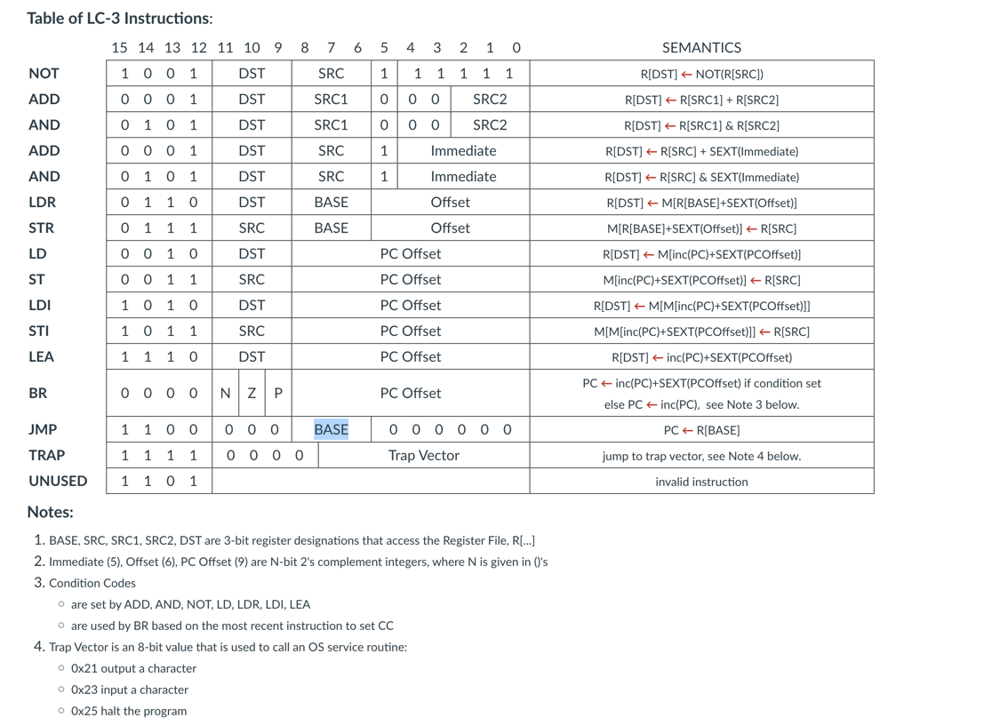
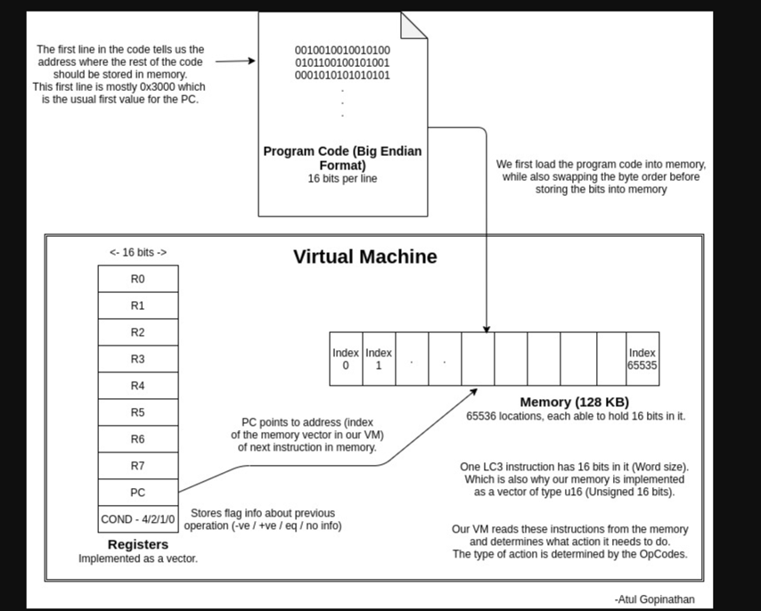

# LC3-VM

## Introduction

Welcome to LC3-VM, an emulator for the LC-3 (Little Computer 3), a teaching microprocessor. This project aims to provide a fully functional emulation ofthe LC-3, allowing users to run LC-3 programs and explore the architecture of this educational computer system.

## Features

- LC-3 Architecture Emulation: Accurately emulates the basic LC-3 architecture, including its instruction set.
- Support for LC-3 Programs: Run LC-3 object files (.obj) like 2048.obj and rogue.obj included in this repository.
- Development Tools Integration: Easy integration with development tools such as CMake for building and managing the project.

## Getting Started

### Prerequisites

- C++ Compiler (GCC, Clang, etc.)
- CMake for building the project

### Installation

Clone the repository:

```bash
git clone https://github.com/Sma1lboy/LC3-VM.git
cd LC3-VM
```

Build the project:

```bash
mkdir build && cd build
cmake ..
make
```

### Run the emulator

Execute the LC3-VM:

```
./lc3-vm [path_to_obj_file]
```

For example:

```
./lc3-vm 2048.obj
```


## Contributing

Contributions are welcome! If you have any improvements or bug fixes, feel free to fork this repository and submit a pull request.

## License

This project is open source and available under the MIT License.


## Ideas

https://acg.cis.upenn.edu/milom/cse240-Fall05/handouts/Ch05.pdf
https://acg.cis.upenn.edu/milom/cse240-Fall05/handouts/Ch09-a.pdf


